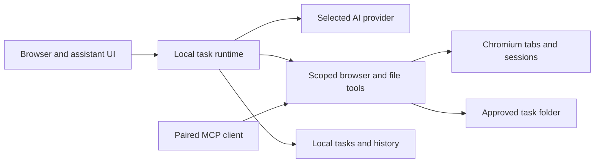

# DeepTrail Product Spec

Status: BrowserOS foundation imported; research alpha implemented. Native release
and live provider/deployment acceptance remain unverified. See DEVELOPMENT.md.
Date: 2026-09-05.
Working name: DeepTrail.

## 1. Product Definition

Implementation addendum: `OVERALL_RUBRIC.md` is the hackathon acceptance
criteria. Research tasks use Linkup for evidence, Nebius Token Factory for
gap analysis and synthesis, and Render Workflows for execution. The user
explicitly reviews the brief/context sent to these services. This cloud
research path is an intentional addition to the originally local-only task
scope; ordinary browser automation remains local. See DEVELOPMENT.md for
implemented behavior, setup, and the remaining release gates.

DeepTrail is a research browser where users can ask an AI to complete work across websites they are logged into, inspect its progress, and take over whenever needed. Users choose their AI provider, retain control over browser context and files, and can inspect the source code.

The central interaction is: give a task, let the agent work in visible browser tabs, review any consequential action, and receive a verifiable result.

Example target workflow: "Collect this month's invoices from these two vendor portals and create a CSV with vendor, date, amount, currency, and source link." The browser finds and downloads documents, produces the CSV, and identifies missing or ambiguous values. It pauses if the user must sign in.

### Decisions and Assumptions

- Open source is an accepted product direction.
- Build on the human-facing BrowserOS browser and agent platform. Its neo product is a secondary reference for agent visibility and external control.
- Aside is the feature and workflow reference. We will use our own branding and interface assets.
- Initial platform: macOS on Apple Silicon. This is a planning assumption, not a confirmed user requirement. Preserve upstream portability for later Windows, Linux, and Intel Mac releases.
- First users: people doing repeated research, administrative, and operational work across web applications.
- First release runs tasks on the user's computer. Cloud inference is allowed through the selected provider; local execution does not mean page context never leaves the device.

## 2. What Aside Does

The following are documented Aside capabilities, checked on 2026-09-05. They have not been independently tested in this workspace. They describe product behavior, not knowledge of Aside's internal architecture.

| Capability | Aside's documented behavior | Our release target |
| --- | --- | --- |
| Browser with AI | Chromium browser with an assistant that starts from the current page. [A1, A2] | MVP |
| Tasks across websites | Browse, inspect pages, work with files, pause for input, and accept follow-up instructions. [A3] | MVP with bounded workflows |
| Provider choice | Aside models, API keys, and OAuth connections for ChatGPT, Claude, and Copilot subscriptions. [A4] | ChatGPT and API keys first; Claude subscription conditional |
| Research | Ultrabrowse offers more involved research and comparison with sources. [A5] | Basic cited comparison in MVP; deeper research later |
| Memory | Reuse browsing, conversation, and task context; review/edit memories and choose retention. [A6] | V1 |
| Routines | Scheduled new tasks and continuation of existing conversations. [A7] | V1 scheduled tasks; continuation later |
| Password autofill | Agents can request permitted autofill without receiving the raw password; people handle MFA and other verification. [A8] | Human login in MVP; mediated autofill later |
| External control | CLI, MCP server, and browser automation REPL. [A9] | Scoped MCP and basic CLI in V1 |

BrowserOS supplies much of the foundation: Chromium, a React extension interface, a local agent server, browser tools, and provider configuration. We still need to validate its behavior and implement the requirements below. Using the same foundation does not establish feature parity or equal task success. [B1, B2]

## 3. First Release Scope

### MVP: Browser, Assistant, and Completed Tasks

| ID | Requirement | Observable acceptance condition |
| --- | --- | --- |
| B1 | Real browsing: address bar, navigation, tabs, bookmarks, downloads, and persistent profiles. Reuse upstream behavior. | A user signs into a test website, restarts the browser, and retains the session; tab creation, closure, and restoration work. |
| B2 | Keep the assistant beside the current website. | Opening and resizing the sidebar preserves the page and does not cover its controls. |
| C1 | Explicit page context. Attach the current tab, selected tabs, or user-selected files; show the attachments before starting. | A task receives only authorized attachments and subsequently authorized browsing context. Unrelated tabs are not silently read. |
| C2 | Cited page questions and comparisons. | Compare three attached pages, link claims to their sources, and identify unavailable information rather than inventing it. |
| P1 | Connect OpenAI and Anthropic API keys; connect ChatGPT through a supported integration. | Connect, run a task, inspect connection status, and disconnect. Invalid credentials and exhausted limits produce actionable states. |
| P2 | Make billing and provider selection explicit. | Settings distinguish subscription usage from metered API usage. A failure never silently changes providers or starts paid API usage. |
| T1 | Execute tasks across tabs using existing browser tools. | The agent completes navigation, extraction, and a form-drafting workflow while users can inspect its tabs. |
| T2 | Visible task progress. | Show concise actions, affected website, elapsed time, pending input, and final status. Do not present fabricated progress or private model reasoning. |
| T3 | Stop, resume, and correct a task. | Stop prevents new tool dispatch; resuming re-inspects the page. A correction applies before the next action that depends on it. |
| T4 | Human handoff for login and verification. | On MFA, CAPTCHA, or an unsupported login step, show the relevant tab and resume only after the user continues. |
| T5 | Review consequential website actions. | Sending, publishing, purchasing, deleting, changing account settings, and sharing data require review of the exact action and target. |
| F1 | Scoped task files. | Downloads and generated CSV/Markdown files are saved to the selected output folder and linked from the task. Existing files are not overwritten without approval. |
| H1 | Local task history. | Reopening a task shows its messages, actions, sources, output links, and outcome. Deleting it offers a separate choice for deleting generated files. |
| R1 | Honest completion and failure reporting. | Success requires observed evidence. Partial results list unfinished work. An uncertain submission is not retried blindly. |

General browsing stays available without an AI connection. Provider support means access to the provider through a supported interface; it does not imply import of existing ChatGPT or Claude conversations, memories, projects, or connectors.

### V1: Persistent Assistance

- Memory: opt-in task and browsing context; inspect, edit, delete, and set retention. Deletions also remove derived search entries. Exclude private browsing and user-blocked sites. Turning memory off stops new collection and retrieval until re-enabled.
- Scheduled routines: save a task, choose schedule/timezone, run now, pause, edit, and delete. Prevent overlapping instances. Record missed runs while asleep or closed; do not replay a backlog automatically. Resume with the next scheduled occurrence. Consequential actions still wait for review.
- External agents: expose scoped browser tools through MCP with pairing, revocation, and the same permission checks used by the built-in assistant. Add CLI start, status, stop, and resume commands.
- Multiple tasks: separate owned tabs and file scopes, enforce one active controller per tab, and surface when a user takes over. Start with sequential execution in MVP.
- Extended provider selection: expose verified upstream local-model and other provider integrations without implying they can complete the same tasks equally well.

### Later Work

- Credential-mediated agent autofill, using established browser/OS credential facilities. Protect passwords from DOM snapshots, screenshots, tool results, and logs; verify the destination origin before filling.
- More capable research with source tracking and comparisons across larger sets of pages.
- Broader document creation/editing, resumable conversation routines, and richer task replay.
- Additional platforms after browser, provider, and permission acceptance checks pass there.
- Claude subscription login only once an approved supported route is established for this product.

Cloud execution, shared team accounts, a custom password vault, mobile browsers, a marketplace, billing infrastructure, and training a model are outside the first release. Existing upstream features may remain available, but are not promised as validated capabilities until tested.

## 4. User Experience

### Main Surfaces

| Surface | Required contents |
| --- | --- |
| Browser | Page content, normal navigation, tabs, assistant toggle, and visible agent ownership for controlled tabs. |
| Assistant sidebar | Conversation, page/file attachments, model selection, task status, action timeline, stop/resume, and output links. |
| New tab / Tasks | Task composer, recent tasks, running tasks, and items waiting for the user. |
| Action review | Website and account when known, exact recipient/target, data being sent or changed, approve-once and cancel. |
| Settings | Providers, permissions, task storage, privacy, memory/routines when available, and updates. |

Use compact controls and existing BrowserOS conventions. Preserve browser keyboard navigation and accessibility. The website remains the primary surface; the assistant must not obscure or unexpectedly navigate a tab the user is actively operating.

### Main Journey

1. Open the browser and complete optional profile import or ordinary website sign-in.
2. Connect an AI provider. Show what data goes to that provider and how usage is charged.
3. Open a website, attach relevant tabs/files, and describe the desired outcome.
4. The agent starts in owned tabs. The user can inspect actions or take over.
5. If access, login, or action review is needed, the task waits with a specific next step.
6. The result includes sources, artifacts, and a clear complete/partial/failed outcome.

### Representative Workflows

- Research: compare three products using selected pages; produce a table with sources and missing facts.
- Records: retrieve invoices from two authenticated test portals; save documents and a CSV with provenance.
- Communications: inspect a support conversation and related account page; compose a reply; wait before sending.
- Follow-up, V1: repeat a saved report every weekday morning and show differences from the prior run.

## 5. Technical Direction

Preserve the BrowserOS architecture and ownership boundaries instead of introducing a second browser shell or duplicate agent loop. The upstream documents describe a Chromium fork, an extension UI, and a local Bun server with CDP-backed tools. Current agent code uses the AI SDK tool loop and MCP browser tools. [B2, B3]

### Reuse Map

| Upstream area | Intended role | Work before modifying it |
| --- | --- | --- |
| `packages/browseros` | Chromium patches, branding, build, signing, and updates. | Build an unchanged pinned revision and identify the minimum required native changes. |
| `packages/browseros-agent/apps/app` | Chat, new-tab experience, and settings. | Trace current task and provider flows and preserve established UI patterns. |
| `packages/browseros-agent/apps/server` | Task orchestration, provider integration, and tool wiring. | Audit existing permissions, persistence, cancellation, and error handling against this spec. |
| Existing browser MCP packages | Browser inspection and action execution. | Verify scopes are enforced at execution for internal and external clients. |
| `browser-use` | Reference and optional later evaluation candidate. | Add only if measured task failures justify replacing or extending a specific capability. Do not run two nested planning loops by default. |

Do not add a new database, framework, scheduler, or service until the selected upstream revision has been inspected. Reuse its storage and runtime where they meet the requirements. This document names logical records and behavior, not a replacement schema.

### Provider Connections

BrowserOS's provider factory contains a ChatGPT OAuth/Codex adapter and an Anthropic API-key provider. Existing code demonstrates a mechanism, not a guarantee of compatibility or authorization for a new distribution. [B4]

- ChatGPT: validate the inherited integration against current supported authentication. Prefer the documented Codex App Server path if the inherited adapter depends on unsupported behavior. This may require a separate runtime integration; do not treat subscription tokens as generic API keys. [P1]
- Claude API: retain the upstream API-key provider for MVP.
- Claude subscription: Anthropic's support guidance describes SDK usage drawing from subscription limits, while its SDK overview requires prior approval for third-party Claude login. Treat availability for this product as unresolved and do not ship a misleading connection button. [P2, P3]
- Each task records its provider, model, and provider-session identifier if applicable. Switching a task's provider requires an explicit user action and disclosure that its context goes to the new provider.
- Revoking a connection removes stored app credentials and stops further requests. Explain that it cannot undo data already transmitted or necessarily revoke a provider-side session.

### Task Lifecycle and Records

Task states: `queued`, `running`, `waiting_for_user`, `waiting_for_approval`, `paused`, `succeeded`, `failed`, and `cancelled`. Partial completion is a result flag with a list of remaining work, not a success claim.

- A new task is queued, then runs when its browser resources are available.
- Waiting states hold no authority to dispatch dependent actions. User input or a valid one-time approval permits continuation.
- Stop cancels pending requests where possible and prevents further tool dispatch. Already-issued website requests may still complete; the UI must say so.
- After a crash, an unfinished task reopens paused. Resume re-inspects the site and any uncertain action before proceeding.
- Retry limits are finite and visible in failure diagnostics. Once repeated attempts make no progress, ask for help or return a partial result.

Persist the task instruction, profile, provider/model, authorized resources, state, timestamps, messages, concise action events, result evidence, and artifact references. Store approval requests with their exact parameters, target, expiry, and consumption state. Record an action as pending before dispatch and record the observed outcome afterwards. An interrupted write remains uncertain until verified.

Credentials live in OS-protected storage, separate from task transcripts. Browser cookies remain in the browser profile and are not exported into model context. Support task deletion and configurable retention. Avoid storing full page snapshots by default when a source reference and concise result suffice.

## 6. Permissions and Data Boundaries

These are implementation requirements, not claims that arbitrary websites can be perfectly classified or that prompt injection is solved.

- Browser tool access is scoped to the selected profile and authorized tabs/sites. Private sessions cannot read normal-profile state or contribute memory.
- Newly encountered origins require scope expansion before private content is read or data is sent. The UI distinguishes a redirect from an authorization grant.
- All built-in and external clients go through server-enforced scopes. A webpage, model-generated instruction, or tool response cannot grant permissions.
- Treat page text as untrusted task data. Instructions embedded in pages do not override the user's task, reveal secrets, or widen access.
- MVP inspection mode exposes observation/search tools, not arbitrary JavaScript, shell, HTTP, or browser mutation tools. Do not promise that loading a page has no server-side effects.
- Preparing a form may trigger autosave. Treat drafts and other remote writes as changes requiring appropriate authorization, even before a final Submit button exists.
- Review sends, posts, purchases, deletions, account changes, and external sharing at the execution boundary. Unknown mutating actions default to review. Unrestricted code or network tools must not bypass it.
- Approvals are bound to the destination, account where identifiable, action parameters, and fresh page state. Changing those invalidates the approval. A prompt-only instruction to ask first is insufficient.
- Resolve filesystem access against the granted folder, including symlinks and traversal. Review uploads and overwrites separately. No unrestricted shell is required for MVP.
- Restrict local control interfaces to intended local clients; use pairing/short-lived authorization and reject untrusted origins. Do not expose an unauthenticated CDP endpoint to websites or the network.
- Clearly disclose that remote models receive selected prompts and relevant page/file context. Do not describe local storage as end-to-end local inference. Telemetry in our distribution defaults off and must exclude content and credentials.

## 7. Delivery Milestones

| Milestone | Deliverable | Exit condition |
| --- | --- | --- |
| M0: Foundation | Fork BrowserOS, record upstream commit, retain license notices, inspect local instructions, and document reproducible development setup. | Unchanged upstream agent tests pass; a baseline browser build runs on the target Mac. Record existing failures instead of masking them. |
| M1: Browse and ask | Browser integration, sidebar, explicit tab context, one API provider, and source-linked answers. | Browsing smoke checks and three-page comparison pass. |
| M2: Act and recover | Owned tabs, task history, scoped files, handoff, cancellation, action review, and crash recovery. | Three MVP workflows and permission/retry checks below pass. |
| M3: Provider-ready MVP | Verified ChatGPT connection plus OpenAI and Claude API keys; connection lifecycle and usage errors. | Connect/run/disconnect checks pass; unsupported Claude subscription UX is absent. |
| M4: Public alpha | Own branding, signed/notarized packaging, update path, notices/source availability, and documented limitations. | Clean-install smoke test and release checks pass on the supported platform. |
| M5: V1 | Memory, local routines, and paired external MCP/CLI access. | Retention, sleep/wake, overlap, revocation, and shared permission checks pass. |

No calendar estimate is committed before M0 establishes build and integration costs. Chromium builds require roughly 100 GB according to upstream documentation. Maintain a small patch set and regularly incorporate upstream security updates. [B5]

## 8. Validation and Release Gates

Use deterministic fixture websites for assertions, plus manually supervised representative real websites. Do not exercise real purchases, public posts, or destructive account changes as automated tests. Reuse the upstream test framework.

| Check | Required result |
| --- | --- |
| Comparison | Correct extraction from three pages, valid source links, explicit missing data. |
| Invoice collection | Expected documents and CSV rows, intact currencies, source provenance, no silent overwrites. |
| Reply drafting | Correct conversation and recipient; exact draft shown; no send before approval. |
| Provider lifecycle | Success, invalid key, expired login, rate limit, disconnect, and reconnect behave without silent billing/provider changes. |
| Login handoff | Task pauses for verification and resumes with fresh page state after the user continues. |
| Cancellation | No new tool call begins after stop acknowledgment; already dispatched actions are reported accurately. |
| Action retry | A timeout after a simulated successful submission does not produce a duplicate submission. |
| Stale approval | A changed recipient, origin, payload, or relevant page state requires new review. |
| Scope enforcement | An unrelated profile/tab, blocked origin, symlink escape, and unpaired local client are rejected. |
| Hostile page | Embedded instructions cannot disclose credentials, expand scope, or silently send attached files. |
| Crash recovery | Task reopens paused; pending actions are reconciled before continuation. |
| Desktop layout | Sidebar open/closed and minimum supported window sizes preserve readable controls, page access, and keyboard focus. |

For alpha, evaluate 20 explicitly listed scenarios, each with three runs using a pinned browser build and recorded provider/model. Initial target: at least 85% verified completions and all boundary/cancellation checks passing. Label this an internal release target, not parity with Aside or a public benchmark. Report latency, usage, interventions, failures, and exclusions alongside success rates.

## 9. Open Decisions

- Final product name and visual identity.
- Confirm Apple Silicon macOS as the first supported platform.
- Select the pinned BrowserOS revision and verify which requirements already pass.
- Establish the supported ChatGPT distribution/authentication path and the status of Claude subscription approval.
- Select the first real-world pilot workflow after fixture tests pass.

These do not block product specification. Authentication questions gate the affected provider feature; signing and license compliance gate public distribution.

## 10. Sources

Aside behavior:

- A1: [Browser changelog](https://docs.aside.com/changelog/native).
- A2: [Side panel](https://docs.aside.com/help/side-panel).
- A3: [Tasks](https://docs.aside.com/help/tasks).
- A4: [AI providers](https://docs.aside.com/help/ai).
- A5: [Ultrabrowse](https://docs.aside.com/help/ultrabrowse).
- A6: [Memory](https://docs.aside.com/help/memory).
- A7: [Routines](https://docs.aside.com/help/automation).
- A8: [Password manager](https://docs.aside.com/help/password-manager).
- A9: [CLI, MCP, and REPL](https://docs.aside.com/help/developers).

Implementation references:

- B1: [BrowserOS repository](https://github.com/browseros-ai/BrowserOS).
- B2: [BrowserOS agent architecture](https://github.com/browseros-ai/BrowserOS/blob/main/packages/browseros-agent/README.md).
- B3: [BrowserOS agent loop](https://github.com/browseros-ai/BrowserOS/blob/main/packages/browseros-agent/apps/server/src/agent/ai-sdk-agent.ts).
- B4: [BrowserOS provider factory](https://github.com/browseros-ai/BrowserOS/blob/main/packages/browseros-agent/apps/server/src/agent/provider-factory.ts).
- B5: [BrowserOS build requirements](https://github.com/browseros-ai/BrowserOS/blob/main/packages/browseros/README.md).
- [BrowserOS AGPL-3.0 license](https://github.com/browseros-ai/BrowserOS/blob/main/LICENSE): retain notices and satisfy applicable corresponding-source requirements for distribution and modified network use.
- [browser-use](https://github.com/browser-use/browser-use) and its [MIT license](https://github.com/browser-use/browser-use/blob/main/LICENSE): optional automation reference/dependency, not part of the selected initial runtime.
- P1: [Codex App Server](https://learn.chatgpt.com/docs/app-server).
- P2: [Claude Agent SDK overview](https://code.claude.com/docs/en/agent-sdk/overview).
- P3: [Claude subscription usage guidance](https://support.claude.com/en/articles/15036540-use-the-claude-agent-sdk-with-your-claude-plan).

Repository links track upstream main and may change. Record exact commits when implementation starts. Benchmark superiority, complete site compatibility, and absolute privacy claims are not assumed from vendor marketing.
